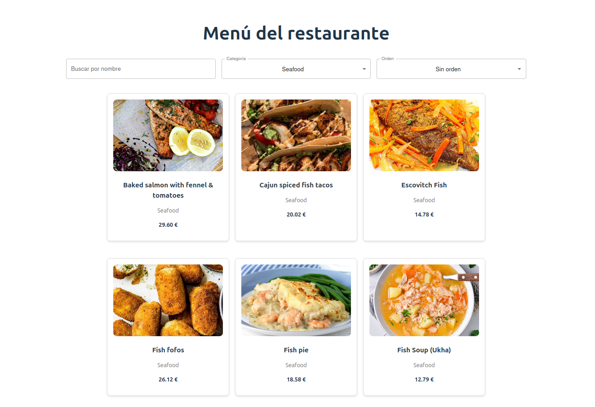

# Restaurant Menu App

A single-page application (SPA) built with React and Vite that displays a restaurant menu. The app fetches seafood dishes from TheMealDB public API and implements search, filtering, and sorting capabilities with a focus on usability principles.


## Screenshot
  



## Project Description

This project is a practical exercise focused on:
- Building a single-page application with React using functional components
- Consuming external data with native `fetch` and managing it with `useEffect`
- Designing reusable components and passing data via props
- Applying basic usability principles (clarity, visual hierarchy, readability, loading/error feedback)
- Managing loading and error states appropriately

---

## Functional Requirements

The application meets all the required functional specifications:

- Display dish list with: name, image, price, and category
- Load data using fetch inside `useEffect` (no external data libraries)
- Assign prices to dishes (the API doesn't provide prices - randomly generated €10-€30)
- Show loading states ("Loading...") and error messages (clear feedback)
- Component structure with at least 3 components: `<App>`, `<MenuList>`, `<MenuItem>` (actually implements 5 components including `<Home>` and `<FilterBar>`)

---

## Technical Requirements

The project fulfills all technical specifications:

- Project setup: Built with Vite
- Functional components: Uses `useState` and `useEffect` hooks
- Native fetch: Browser's native fetch API (no Axios)
- Responsive styling: CSS with grid/flexbox layout, enhanced with Material-UI components

---

## API Integration

The application uses the specified TheMealDB public API (free, no registration required):

```
https://www.themealdb.com/api/json/v1/1/filter.php?c=Seafood
```

Response structure:
- Contains a list of dishes (`meals`) with: `idMeal`, `strMeal` (name), and `strMealThumb` (image)
- Prices are client-side generated (random values between 10€-30€) as the API doesn't provide pricing

Data normalization (src/App.jsx:27-33):
Each item is transformed to include: `id`, `name`, `category`, `thumb`, and `price`

---

## Usability Principles Applied

The interface implements the following usability fundamentals:

- Clarity and readability: Standard typography with sufficient contrast using Material-UI
- Visual hierarchy: Image → Name → Category → Price structure in each card
- Immediate feedback: Loading states and clear, understandable error messages
- Appropriate touch/click targets: Adequate spacing and button sizes
- Responsive design: Adaptive grid layout that adjusts to screen width

---

## Optional Extras Implemented

All optional features have been implemented:

- Category filter**: Browse dishes by food category
- Search by name**: Real-time search as you type
- Sort by price**: Ascending/descending price ordering

---

## Getting Started

### Prerequisites

- Node.js (v18 or higher recommended)
- npm or yarn

### Installation

1. Clone the repository:
```bash
git clone https://github.com/riordi80/react-fetch-restaurant-menu
cd MenuRestauranteViteApiFetch
```

2. Install dependencies:
```bash
npm install
```

3. Start the development server:
```bash
npm run dev
```

4. Open your browser and navigate to `http://localhost:5173`

### Available Scripts

| Command | Description |
|---------|-------------|
| `npm run dev` | Start development server with HMR |
| `npm run build` | Build for production |
| `npm run preview` | Preview production build locally |
| `npm run lint` | Run ESLint to check code quality |

---

## Project Structure

```
src/
├── components/
│   ├── filterBar/          # Search, category, and sort controls
│   │   └── FilterBar.jsx
│   ├── menuItem/           # Individual dish card component
│   │   ├── MenuItem.jsx
│   │   └── MenuItem.css
│   └── menuList/           # Grid container for menu items
│       ├── MenuList.jsx
│       └── MenuList.css
├── pages/
│   └── home/               # Main page with filtering logic
│       ├── Home.jsx
│       └── Home.css
├── App.jsx                 # Root component with API integration
├── main.jsx               # Application entry point
└── index.css              # Global styles
```

---

## Architecture

### Component Hierarchy

1. **App.jsx**: Root component that fetches menu data from TheMealDB API on mount, normalizes the response, and manages loading/error states
2. **Home.jsx**: Main page that receives menu data and manages filter state (search, category, sort)
3. **FilterBar.jsx**: Provides user controls for filtering and sorting
4. **MenuList.jsx**: Renders the filtered menu items in a responsive grid
5. **MenuItem.jsx**: Displays individual dish information (image, name, category, price)

### Key Implementation Details

- **State Management**: Local state with `useState` and `useMemo` (no global state library)
- **API Integration**: Single fetch in `useEffect` with cleanup pattern (isMounted flag) in src/App.jsx:14-52
- **Data Normalization**: TheMealDB API response transformed to internal format in src/App.jsx:27-33
- **Controlled Components**: All filter inputs use the controlled component pattern
- **Performance Optimization**: Filtering/sorting logic memoized in src/Home.jsx:12-20 to prevent unnecessary recalculations

---

## Technologies Used

- **React 19** - Modern React with hooks and concurrent features
- **Vite** - Fast build tool and development server with HMR
- **Material-UI (MUI)** - React component library for elegant, accessible UI
- **TheMealDB API** - External API for meal data
- **ESLint** - Code quality and consistency (with React Hooks and React Refresh plugins)

---

## Development Notes

In development mode with React 18 and StrictMode, effects may execute twice. This is normal behavior and doesn't occur in production builds.

---

## License

This project is for educational purposes.